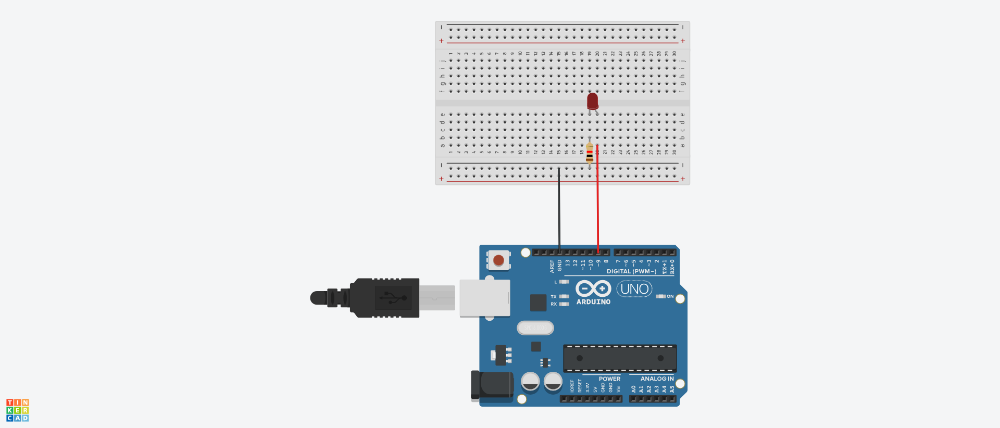

# LED 예제 1
## LED 깜박이기
.

## LED 깜박이기 Source code

 ```c
void setup() {
  pinMode(9, OUTPUT);    // sets the digital pin 13 as output
}

void loop() {
  digitalWrite(9, HIGH); // sets the digital pin 13 on
  delay(1000);            // waits for a second
  digitalWrite(9, LOW);  // sets the digital pin 13 off
  delay(1000);            // waits for a second
}

 ```
## a와 b로 LED켜고 끄기
```c
void setup()
{
  Serial.begin(9600);
  pinMode(9,OUTPUT);
 
}

void loop(){
 if(Serial.available() > 0)
{
  char sData = Serial.read();
  if(sData =='a')
{
    digitalWrite(9,HIGH);
}
  else if(sData == 'b')
{
 digitalWrite(9,LOW);
  }
 }
}
```
