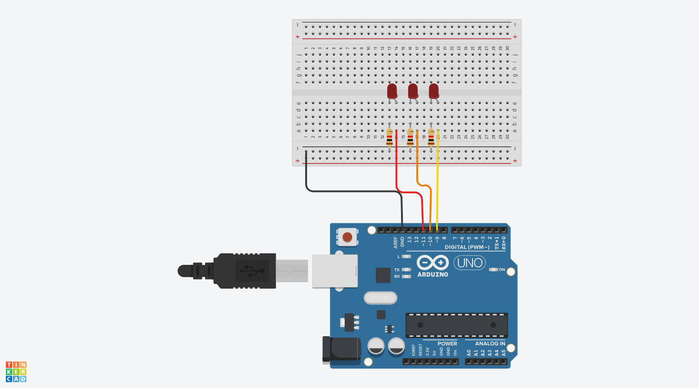
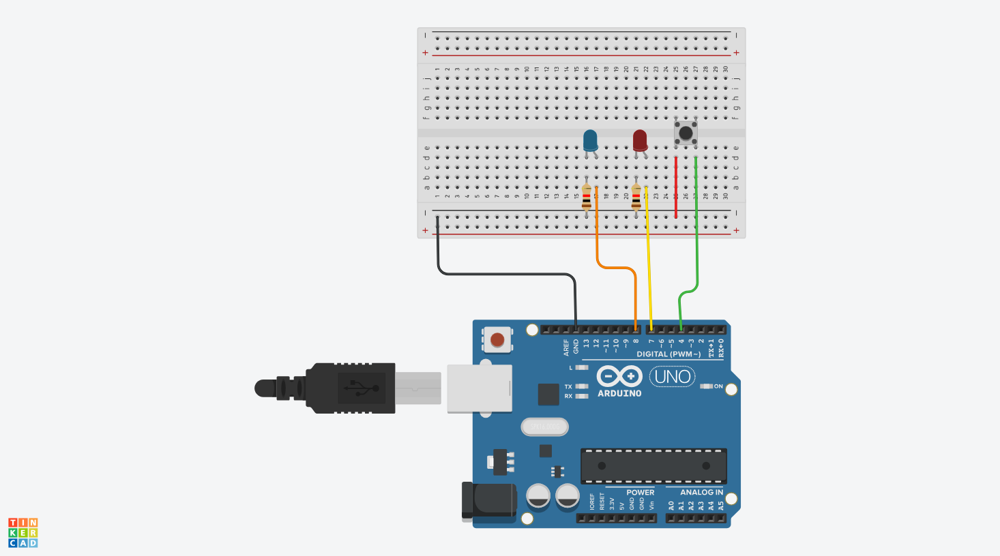

# LED 예제 1
## LED 깜박이기
.

## LED 깜박이기 Source code

 ```c
void setup() {
  pinMode(9, OUTPUT);    // sets the digital pin 13 as output
}

void loop() {
  digitalWrite(9, HIGH); // sets the digital pin 13 on
  delay(1000);            // waits for a second
  digitalWrite(9, LOW);  // sets the digital pin 13 off
  delay(1000);            // waits for a second
}

 ```
## a와 b로 LED켜고 끄기
```c
void setup()
{
  Serial.begin(9600);
  pinMode(9,OUTPUT);
 
}

void loop(){
 if(Serial.available() > 0)
{
  char sData = Serial.read();
  if(sData =='a')
{
    digitalWrite(9,HIGH);
}
  else if(sData == 'b')
{
 digitalWrite(9,LOW);
  }
 }
}
```
## LED 3개 동시에 키기
.
## LED 3개 동기에 키기 Source code
```c
#define LED1 9
#define LED2 10
#define LED3 11
void setup()
{
  Serial.begin(9600);
  pinMode(LED1,OUTPUT);
  pinMode(LED2,OUTPUT);
  pinMode(LED3,OUTPUT);
}

void loop()
  
{
 
    
    digitalWrite(LED1,HIGH);
    digitalWrite(LED2,HIGH);
 	digitalWrite(LED3,HIGH);
  
   delay(1000);
  
  digitalWrite(LED1,LOW);
  digitalWrite(LED2,LOW);
  digitalWrite(LED3,LOW);
 
 delay(1000);

}

```
## LED 버튼눌러 번갈아 키기
.
## LED 버튼눌러 번갈아 키기 Source code
```c
#define BUTTON 4
#define LED_BLUE 8
#define LED_RED 7
#define DELAY_TIME 80

int state = 0;

void setup()
{
  Serial.begin(9600);
  pinMode(BUTTON,INPUT_PULLUP);
  pinMode(LED_BLUE,OUTPUT);
  pinMode(LED_RED,OUTPUT);
  
  
}

void loop()
  
{
  int buttonValue=digitalRead(BUTTON);
  if(buttonValue ==1){
    state =! state;
 	delay(500);
  }
  if(state ==0){
    digitalWrite(LED_BLUE,HIGH);
    digitalWrite(LED_RED,LOW);
    delay(DELAY_TIME);
    digitalWrite(LED_RED,HIGH);
    digitalWrite(LED_BLUE,LOW);
    delay(DELAY_TIME);
  }
  else if (state==1){
    digitalWrite(LED_BLUE,LOW);
    digitalWrite(LED_RED,LOW);  
    
  }
}
```
